  

--- 
# 🏆 FuzzRaiders — Raider of the Month  
## 🎖️ March 2026 | Mysto
---

## 👤 Profile

**Name:** Mysto  
**Role:** Mobile Security Specialist  
**Status:** ELITE PERFORMANCE VERIFIED  

---

## 📊 Performance Breakdown

This recognition is based on **verified output, consistency, and real execution**:

- ⏱️ **96+ Hours of Structured Study & Execution**  
- 📝 **10 High-Quality Technical Write-Ups** *(Reviewed & Documented)*  
- 🧪 **3 Complete Security Projects** *(End-to-End Execution)*  
- 💻 **20+ Hack The Box Labs** *(Hands-on Exploitation & Analysis)*  

---

## 🧠 What This Means

This is not passive learning.  
This is **applied cybersecurity in action**.

Mysto has demonstrated:

- Relentless consistency with zero performance drop  
- Ability to solve complex technical challenges  
- Transition from learning → execution → documented output  
- Discipline aligned with professional offensive security standards  

Every hour invested resulted in **real, measurable capability**.

---

## ⚙️ Technical Execution & Methodology

All outputs delivered by Mysto follow a **structured and professional workflow**:

- Methodology-driven testing approach  
- Step-by-step technical validation  
- Clean, standardized documentation  
- Real-world applicable attack & analysis techniques  

This ensures his work is not only completed — but **repeatable, reviewable, and reliable**.

---

## 🛡️ Alignment with FuzzRaiders System

Mysto’s performance reflects full alignment with internal standards:

- ✔️ Methodology-based execution  
- ✔️ Internal Review & Validation Process  
- ✔️ SOP-driven workflow & discipline  
- ✔️ Standardized Templates & Documentation  

All outputs meet the requirement of being:  
**Structured. Verified. Client-ready.**

---

## 📈 Impact

- Set a new execution benchmark within the team  
- Strengthened the culture of discipline and accountability  
- Contributed to the technical growth of the entire system  
- Demonstrated what real offensive security progression looks like  

---

## 🏁 Final Statement

Mysto’s performance proves one thing:

> **Discipline + System + Execution = Real Results**

This recognition is not given for effort —  
it is earned through **consistent, verifiable output and real impact**.

---

## 🧠 Leadership Note
Mysto, you have proven that FuzzRaiders is not built on words — but on consistent execution, a structured system, and verified results.

---

## 🔒 FuzzRaiders

FuzzRaiders is not just a team —  
it is a **high-performance system built on discipline, structure, and real execution**.

Every achievement documented here represents:  
**Real Work. Real Growth. Real Capability.**

---

## ⚡ Standard

> Grow • Learn • Execute • Dominate